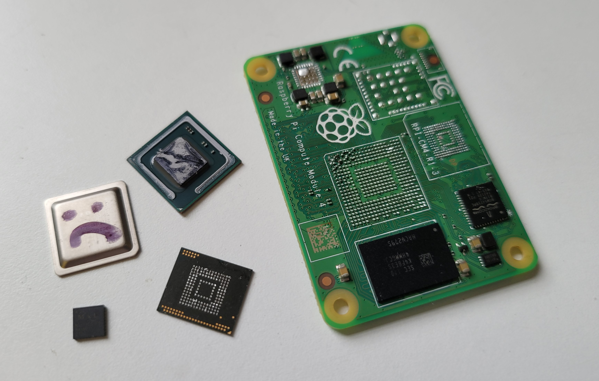

# Recovering data from a bricked Raspberry Pi CM4

## The Problem
I like the CM4, but it's pretty easy to blow them up. The PMIC doesn't have any kind of overcurrent protection, so if you short any rail to ground, or any pin driven high, it will die. Replacement PMIC's are *almost* available, but not quite. Earlier versions of the chip are on sale from Mouser, etc., but not the P4 revision that's on the Pi 4 / CM4. That may have changed by the time you're reading this. In any case, replacing the PMIC won't help if your SoC is also dead.

I've blown up three of them so far by doing various stupid things. They're not expensive, but if you've got some critical data stored on one and it ain't backed up properly - expect trouble.

To avoid cross-compilation I had been doing quite a lot of work on the Pi itself, working on a custom kernel module. I hadn't noticed, but a pile of vital files weren't checked into git, and I'd been a bit sloppy with regular pushes anyway, so when I accidentally dropped a scope probe on the PCB my heart sank.

## The Solution
Luckily, eMMC chips are electrically compatible with [micro]SD cards, so all we need to do is convert the dead CM4 into an SD card. What follows is a description of how I figured out how to do it, and a guide for you to follow if you find yourself in a similar situation.

There is an alternative solution - tools exist that can directly read a desoldered eMMC chip. They are used by people who recover data from phones. However, they're quite expensive and it would have taken a few days to get my hands on one, so I took the path less trodden. 

## Gathering the information
In principle, all we need to know for this hack is the locations on the CM4 board of each of the eMMC bus signals. Once those are known, we can connect them to something that can read SD cards, e.g. a USB SD reader and suck out the data.

First I needed a sacrificial CM4. Luckily one was available (see above) so no problems there. I removed various chips to get access to the signals, then traced them out.

I've done this once, so you don't have to do it yourself or sacrifice any hardware, but I'll include a description of my method because it could be applied to other Pis, or other SBC's for that matter.

### Clearing the decks
I don't have an x-ray machine, so I had to probe around with a multimeter like a caveman. Where to start? Well, we know the signals need to get to the pads of the eMMC, so I desoldered that with a hot-air reflow station. 

The signals start at the SoC, so I removed the head spreader by gently prying it off with a scalpel, then removed the SoC with hot air. Be patient when doing this - the part has underfill glue, so it really takes some heat before it lets go. On my first board I got a bit impatient, started prying with a scalpel, slipped and mashed a load of pads. Luckily none that I needed to access.

Next I removed the PMIC - I knew it was dead, so it would probably interfere with the power rails.

After all that, I had this sitting on my bench.

### Tracing the signals
Next up, I needed the pinout for the eMMC. The part on my CM4 is a KLM8G1GETF. I found the datasheet on a dodgy phone repair site, but it doesn't matter if you can't get the exact datasheet for your part - eMMC's in the same package have compatible pinouts. [I've mirrored the datasheet here.](docs/KLMxGxJENB-B041-1.0.pdf?raw=1) 
Here's a snap of the pinout from the datasheet:
[!eMMC pinout diagram](images/emmc-pinout.png?raw=1)]
